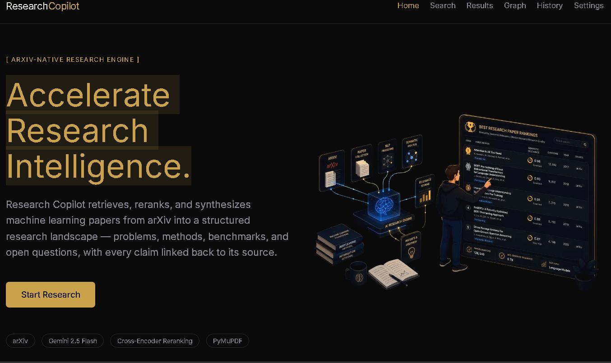
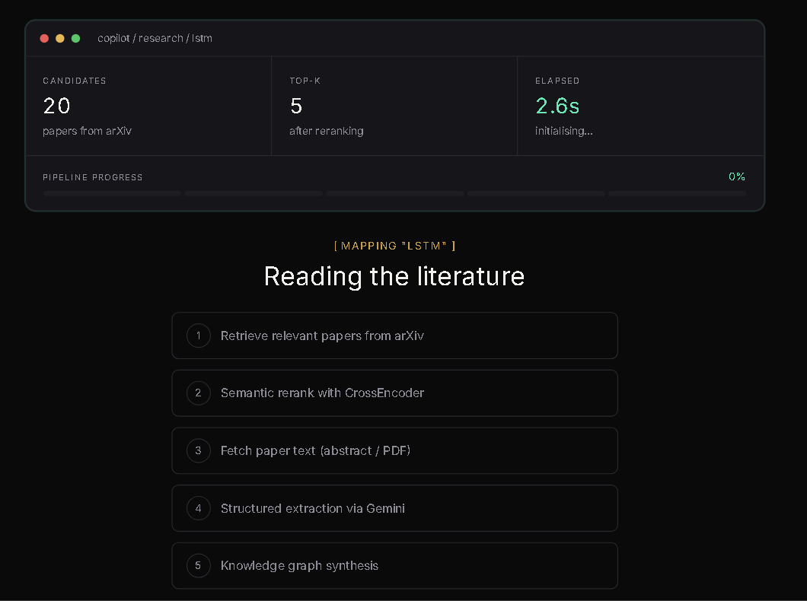
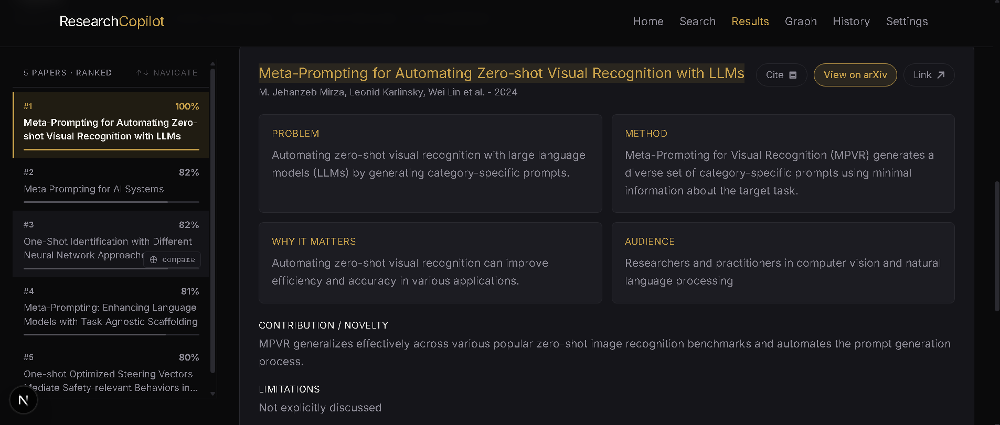
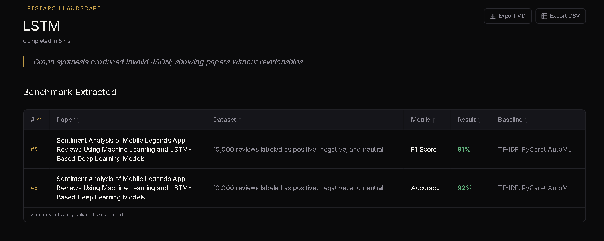
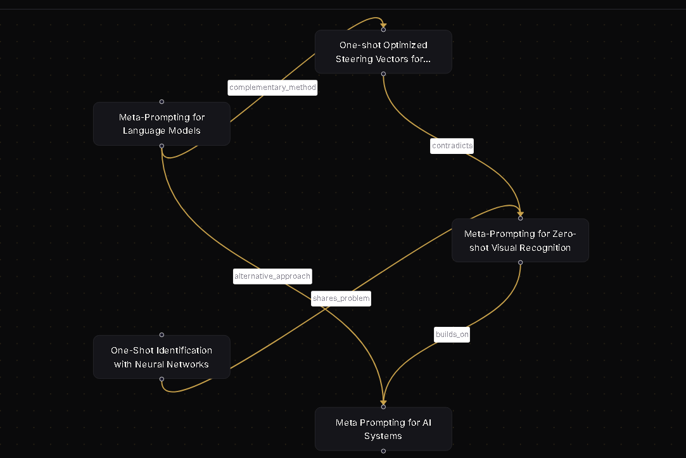

<div align="center">

# Research Copilot.

**Map an entire ML research field from a single search query.**

Research Copilot is a full-stack RAG pipeline that retrieves papers from arXiv, parses their full PDFs, extracts structured information via Gemini, and synthesizes a knowledge graph showing how papers relate — all in one search.

[](https://fastapi.tiangolo.com)
[](https://nextjs.org)
[](https://aistudio.google.com)
[](https://docker.com)
[](LICENSE)

</div>

---

## Overview



Enter any ML topic in plain English. The pipeline runs in the background:

```
Query → arXiv retrieval (20 candidates)
      → Cross-encoder semantic reranking (top 5)
      → Concurrent PDF download + PyMuPDF text extraction
      → Batched Gemini structured extraction
          (problem · method · dataset · results · benchmarks · limitations)
      → Gemini knowledge graph synthesis
          (builds_on · contradicts · shares_dataset · open problems)
      → Interactive React Flow visualization
```

Every stage streams progress back to the UI in real time via SSE. Results are cached in SQLite so repeat searches are instant and cost zero API calls.

---

## Screenshots

### Real-time Pipeline Progress


*Each stage completes in real time with actual backend timings streamed via SSE. The macOS-style dashboard shows candidates retrieved, top-k selected, and elapsed time live.*

---

### Results — Ranked Papers with Structured Extraction


*Papers ranked #1–5 by relevance score. Click any paper to expand Problem, Method, Why It Matters, and Audience in a 2×2 card grid. Contribution, Limitations, and Prerequisites appear below.*

---

### Benchmark Extracted


*Only shows metrics explicitly reported in the paper text — never estimated. Sortable by any column. Baseline comparison included where available.*

---

### Knowledge Graph


*Inter-paper relationships (builds_on, contradicts, alternative_approach, shares_problem) rendered as an interactive node graph. Click any node to open a summary panel.*

---

## Features

- **Real-time pipeline progress** — SSE streaming shows each stage completing with actual backend timings
- **Full PDF parsing** — reads first 10 pages of each paper via PyMuPDF, not just abstracts
- **Structured extraction** — problem, method, dataset, results, contribution, limitations, prerequisites, audience, and benchmark metrics (precision/recall/F1/accuracy/BLEU/ROUGE) extracted per paper
- **Knowledge graph** — inter-paper relationships rendered as an interactive node graph (React Flow), clickable nodes show paper summaries
- **Benchmark Extracted table** — only shows metrics that were explicitly reported in the paper text, never estimated
- **Tech Stack Match** — compares each paper's implementation requirements against your personal tech stack (set in Settings)
- **Search history** — previous queries persist in localStorage with one-click result restore
- **Light/dark theme** — toggleable, persists across sessions
- **Gemini rate-limit defense** — asyncio semaphore caps concurrent requests, automatic fallback to secondary model on 429, SQLite cache eliminates redundant calls on repeat queries
- **Docker Compose** — single command brings up both backend and frontend in production mode

---

## Tech Stack

| Layer | Stack |
|---|---|
| Backend | Python 3.11, FastAPI, Uvicorn |
| LLM | Google Gemini 2.5 Flash-Lite (extraction + synthesis) |
| Embeddings / Reranking | sentence-transformers `cross-encoder/ms-marco-MiniLM-L-6-v2` |
| PDF parsing | PyMuPDF (fitz) |
| Data retrieval | arXiv Python client |
| Caching | SQLite via cache_service (per-paper text, per-query graph, per-query result) |
| HTTP client | httpx (async, concurrent PDF downloads) |
| Frontend | Next.js 16, React 19, Tailwind CSS v4 |
| Graph visualization | React Flow |
| Fonts | Fraunces (display), Inter (body), IBM Plex Mono (data) |
| Containerization | Docker, Docker Compose (multi-stage builds, CPU-pinned PyTorch) |

---

## Project Structure

```
research-mapper/
├── backend/
│   ├── app/
│   │   ├── main.py                  # FastAPI app, /search, /search/stream, /tech-match
│   │   ├── models/
│   │   │   └── schemas.py           # Pydantic models for the full pipeline
│   │   └── services/
│   │       ├── arxiv_service.py     # Stage 1: async arXiv retrieval
│   │       ├── rerank_service.py    # Stage 2: async CrossEncoder reranking
│   │       ├── pdf_service.py       # Stage 3: concurrent download + PyMuPDF extraction
│   │       ├── extraction_service.py# Stage 4: batched Gemini structured extraction
│   │       ├── graph_service.py     # Stage 5: Gemini knowledge graph synthesis
│   │       ├── gemini_client.py     # Shared Gemini client: semaphore, fallback, retry
│   │       ├── cache_service.py     # SQLite cache: paper text, graphs, full results
│   │       └── techmatch_service.py # On-demand tech stack alignment per paper
│   ├── requirements.txt
│   ├── .env.example
│   └── Dockerfile
├── frontend/
│   ├── app/
│   │   ├── page.js                  # Home (hero, feature grid, FAQ)
│   │   ├── search/page.js           # Search input
│   │   ├── processing/page.js       # Real-time SSE pipeline progress
│   │   ├── results/page.js          # Ranked papers, benchmarks, insights
│   │   ├── graph/page.js            # Interactive knowledge graph
│   │   ├── history/page.js          # Past searches
│   │   └── settings/page.js         # Theme, tech stack, profile
│   ├── components/
│   │   ├── Navbar.js
│   │   ├── PapersExplorer.js        # Ranked #1–5 list with click-to-expand detail
│   │   ├── PaperDetail.js           # Problem/method/insights box grid per paper
│   │   ├── BenchmarkExtracted.js    # Only shows metrics actually reported in paper
│   │   ├── ProblemMethodGrid.js     # Problem · Method · Why it Matters · Audience
│   │   ├── PipelinePreviewWindow.js # macOS-style stats window on Processing page
│   │   ├── GraphView.js             # React Flow canvas
│   │   ├── PaperPanel.js            # Click-to-open side panel in graph view
│   │   └── TechMatchBadges.js       # High/Moderate/Low match badges
│   ├── context/
│   │   ├── ResearchContext.js       # SSE stream consumer, shared pipeline state
│   │   └── UserProfileContext.js    # Theme, tech stack, profile (localStorage)
│   ├── lib/
│   │   └── historyStore.js          # localStorage read/write for search history
│   └── Dockerfile
├── assets/                          # Screenshots for README
└── docker-compose.yml
```

---

## Local Setup (without Docker)

### Prerequisites
- Python 3.11+
- Node.js 22+
- A Gemini API key from [aistudio.google.com](https://aistudio.google.com)

### Backend

```bash
cd backend
python -m venv venv
source venv/bin/activate        # Windows: venv\Scripts\activate
pip install -r requirements.txt
cp .env.example .env            # then add your GEMINI_API_KEY
uvicorn app.main:app --reload --port 8000
```

Test the backend is running:
```bash
curl http://localhost:8000/health
# {"status":"ok"}
```

### Frontend

```bash
cd frontend
npm install
npm run dev
```

Open [http://localhost:3000](http://localhost:3000).

---

## Docker Setup

```bash
# 1. Copy and fill in your env file
cp backend/.env.example backend/.env
# edit backend/.env and set GEMINI_API_KEY

# 2. Build and start both services
docker compose up --build
```

| Service | URL |
|---|---|
| Frontend | http://localhost:3000 |
| Backend | http://localhost:8000 |
| Health check | http://localhost:8000/health |

> **Note:** The backend image uses a CPU-only PyTorch wheel (`torch+cpu`) to avoid pulling ~1.5GB of unused CUDA libraries. First build takes 3–5 minutes; subsequent builds are cached.

---

## Environment Variables

Create `backend/.env` from `backend/.env.example`:

```env
# Required
GEMINI_API_KEY=your_key_here

# Optional — defaults shown
GEMINI_MODEL=gemini-2.5-flash-lite
ARXIV_CANDIDATE_COUNT=20
TOP_K_PAPERS=5
ALLOWED_ORIGINS=http://localhost:3000
```

Frontend env — create `frontend/.env.local`:
```env
NEXT_PUBLIC_API_URL=http://localhost:8000
```

---

## API Endpoints

| Method | Endpoint | Description |
|---|---|---|
| `GET` | `/health` | Health check |
| `GET` | `/search?query=...` | Full pipeline, returns complete JSON response |
| `GET` | `/search/stream?query=...` | Full pipeline via SSE — streams stage events in real time |
| `POST` | `/tech-match` | On-demand tech stack alignment for a set of papers |
| `POST` | `/cache/clear` | Manually invalidate all cached results |

### SSE Event Format (`/search/stream`)

```
event: stage
data: {"stage": "retrieving", "progress": 1, "total": 5, "message": "Searching arXiv...", "elapsed": null}

event: stage
data: {"stage": "retrieved", "progress": 1, "total": 5, "message": "Found 20 candidates.", "elapsed": 2.8}

event: result
data: {"data": { ...full SearchResponse JSON... }, "total_elapsed": 47.2}

event: error
data: {"message": "...error description..."}
```

---

## Pipeline Performance

Typical timings on a fresh (uncached) query:

| Stage | Typical time | Notes |
|---|---|---|
| arXiv retrieval | ~3s | Network I/O, runs in thread pool |
| CrossEncoder reranking | ~7s | CPU inference, runs in thread pool |
| PDF download + parse | ~11s | 5 concurrent downloads, PyMuPDF in thread pool |
| Gemini extraction | ~15s | Single batched call, Gemini API latency |
| Gemini synthesis | ~10s | Graph JSON ~2-3k tokens |
| **Total (cold)** | **~45-50s** | |
| **Total (cached)** | **<100ms** | |

All CPU-bound and blocking I/O runs in `asyncio.get_running_loop().run_in_executor()` so the FastAPI event loop stays free for concurrent requests throughout.

---

## Rate Limits and Caching

The pipeline uses exactly **2 Gemini calls per fresh search**:
1. One batched extraction call (all 5 papers in a single prompt)
2. One knowledge graph synthesis call

**SQLite caching at three levels:**
- Per arXiv paper text — avoids re-downloading PDFs
- Per paper-set graph — avoids re-synthesizing the same combination
- Per query result — serves complete cached response in <100ms

Repeat searches cost **0 Gemini calls.**

An `asyncio.Semaphore` caps concurrent Gemini requests at 3. On `429 ResourceExhausted`, the client automatically retries on a fallback model before propagating the error.

---

## Acknowledgements

- [arXiv](https://arxiv.org) for open access paper metadata and PDFs
- [Google AI Studio](https://aistudio.google.com) for the Gemini API
- [sentence-transformers](https://www.sbert.net) for the CrossEncoder reranking model
- [React Flow](https://reactflow.dev) for the knowledge graph visualization
- [PyMuPDF](https://pymupdf.readthedocs.io) for PDF text extraction

---

<div align="center">
  <sub>Built by <a href="https://github.com/Ishan-debugg">Ishan Tarkas</a></sub>
</div>
